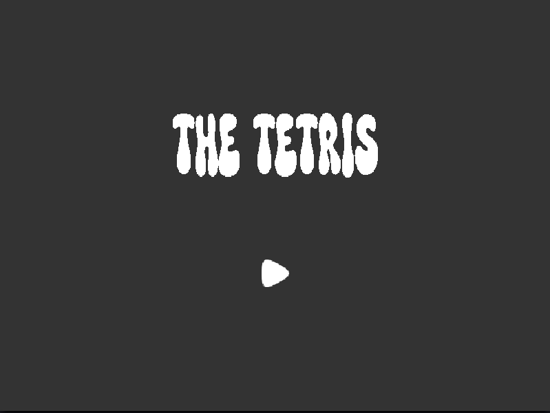
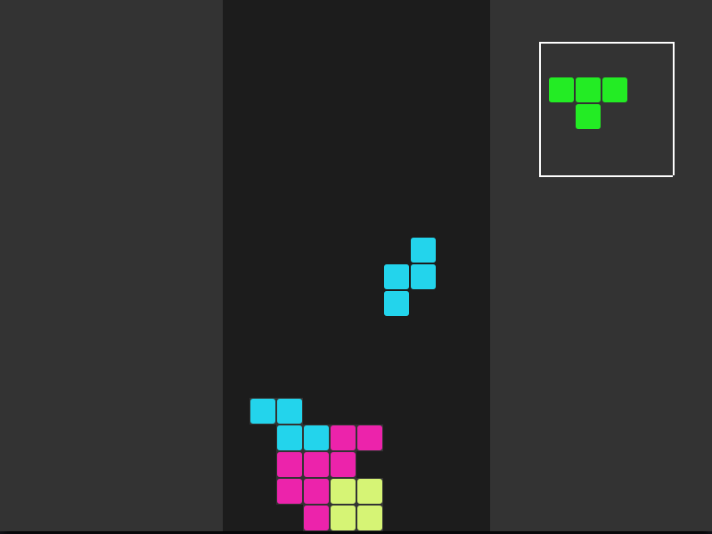
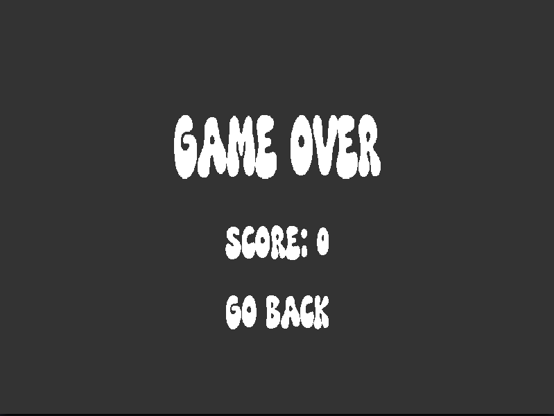

# Tetris using SDL2

## Running instruction

```sh
# create build directory
mkdir build

# compile the project
make

# run 
./build/tetris
```

## Looks




## Dependencies
- [SDL2](https://www.libsdl.org/)
- [SDL2_image](https://github.com/libsdl-org/SDL_image)
- [SDL2_ttf](https://github.com/libsdl-org/SDL_ttf)
- [SDL2_mixer](https://github.com/libsdl-org/SDL_mixer)

## Credits
- Music: [pixabay.com](https://pixabay.com/)
- Fonts: [fontspace.com](https://www.fontspace.com/)